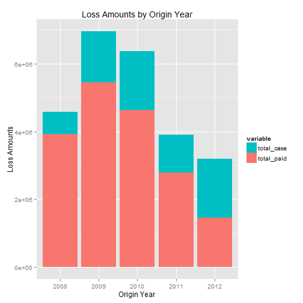
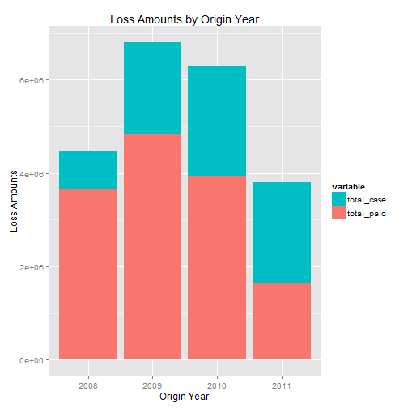

<!--
%\VignetteEngine{knitr}
%\VignetteIndexEntry{Introduction to reserve}
-->


The goal of this document is to introduce you to the basic tools `reserve` provides, and to walk you through a realistic example using the `reserve` package.

It is often difficult to create reproducible actuarial reserve reports in Excel.  R has many advantages over Excel for creating reprodicible reports (in R you type commands rather than pointing and clicking, R can work with larger datasets, etc.). The goal of the `reserve` package is to provide a standard process for creating reserve reports using R. `reserve` provides a standard means of storing your claims data so you can use the same set of functions (defined by `reserve`) to automate many repetetive reserving tasks, and create reproducible reports that are generated directly from the original claim loss detail.

When your report is not directly created from the the original loss detail (as provided by the insurance company) your report looses flexibility (e.g. If you create a development triangle using no excess retention limits there is no way to create a new development triangle based on an excess retention limit of 250,000 because the data is summarized on an origin period basis; claim detail is lost). This practice of using data summarized on an origin period basis is popular when using Excel because keeping all the historical loss information in Excel quickly results in data sets too large for Excel to handle.  I run into problems after a couple hundred thousand rows using Excel 2010.

The `reserve` package improves flexibility in reserve report creation by maintaining access to all the original claim detail (i.e each report is generated from the original claim data as apposed to a summary of the original claim data); `reserve` makes the reserve report generation process reprodicible.  `reserve` provides a standard format for storing claim loss detail and provides a set of functions specific to that standard format.  The standard format is the S3 class `loss_df`.  A `loss_df` is created using the `loss_df()` function.  A `loss_df` holds and cetegorizes loss information on a claim or occurence basis, and is flexible enough to handle data that is organized differently by different companies. 

The `reserve` package comes with the following sample data set:

```r
str(losses)
```

```
## 'data.frame':	11104 obs. of  47 variables:
##  $ claim_number        : Factor w/ 2631 levels "1338675841","1339340317",..: 27 33 34 69 81 111 123 125 185 187 ...
##  $ incident_date       : Date, format: "2008-07-23" "2008-07-11" ...
##  $ policy_number       : Factor w/ 90 levels "2010","2040",..: 1 1 1 1 1 1 1 1 1 1 ...
##  $ fiscal_year_desc    : Factor w/ 5 levels "2008/2009","2009/2010",..: 1 1 1 1 1 1 1 1 1 1 ...
##  $ start_date          : Date, format: "2013-04-01" "2013-04-01" ...
##  $ end_date            : Date, format: "2013-06-30" "2013-06-30" ...
##  $ closed_date         : Date, format: "2008-09-11" "2008-09-16" ...
##  $ claimant_status_d   : Factor w/ 3 levels "Closed","Open",..: 1 1 1 1 1 1 1 1 1 1 ...
##  $ claimant_type_desc  : Factor w/ 3 levels "Indemnity","Medical Only",..: 2 2 2 2 1 1 2 2 2 2 ...
##  $ litigated           : int  0 0 0 0 0 0 0 0 0 0 ...
##  $ adjusting_loc_rec   : Date, format: "2008-07-25" "2008-07-23" ...
##  $ incident_reported   : logi  NA NA NA NA NA NA ...
##  $ payment_amount      : num  142 0 2720 1372 14293 ...
##  $ reserve_amount      : num  142 0 2720 1372 14293 ...
##  $ payment_no_reserve_a: num  0 0 0 0 0 0 0 0 0 0 ...
##  $ payment_amount_peri : num  0 0 0 0 0 0 0 0 0 0 ...
##  $ X1_Med_Payment      : num  142 0 2720 1372 5904 ...
##  $ X1_Med_reserve      : num  142 0 2720 1372 5904 ...
##  $ X1_med_recovery     : num  0 0 0 0 0 0 0 0 0 0 ...
##  $ X2_td_payment       : num  0 0 0 0 0 0 0 0 0 0 ...
##  $ X2_td_reserve       : num  0 0 0 0 0 0 0 0 0 0 ...
##  $ X2_td_recovery      : num  0 0 0 0 0 0 0 0 0 0 ...
##  $ X3_pd_payment       : num  0 0 0 0 8389 ...
##  $ X3_pd_reserve       : num  0 0 0 0 8389 ...
##  $ X3_pd_recovery      : num  0 0 0 0 0 0 0 0 0 0 ...
##  $ X4_exp_payment      : num  0 0 0 0 0 0 0 0 0 0 ...
##  $ X4_exp_reserve      : num  0 0 0 0 0 0 0 0 0 0 ...
##  $ X4_exp_recovery     : num  0 0 0 0 0 0 0 0 0 0 ...
##  $ X5_other_payment    : num  0 0 0 0 0 0 0 0 0 0 ...
##  $ X5_other_reserve    : num  0 0 0 0 0 0 0 0 0 0 ...
##  $ X5_other_recovery   : num  0 0 0 0 0 0 0 0 0 0 ...
##  $ X6_empliab_payme    : num  0 0 0 0 0 0 0 0 0 0 ...
##  $ X6_empliab_reserv   : num  0 0 0 0 0 0 0 0 0 0 ...
##  $ X6_empliab_recovery : num  0 0 0 0 0 0 0 0 0 0 ...
##  $ payment_1med_period : num  0 0 0 0 0 0 0 0 0 0 ...
##  $ payment_2td_period  : num  0 0 0 0 0 0 0 0 0 0 ...
##  $ payment_3pd_period  : num  0 0 0 0 0 0 0 0 0 0 ...
##  $ payment_4exp_period : num  0 0 0 0 0 0 0 0 0 0 ...
##  $ payment_5other_perio: num  0 0 0 0 0 0 0 0 0 0 ...
##  $ payment_6empliab_pe : num  0 0 0 0 0 0 0 0 0 0 ...
##  $ label1              : Factor w/ 1 level "Medical": 1 1 1 1 1 1 1 1 1 1 ...
##  $ label2              : Factor w/ 1 level "TD": 1 1 1 1 1 1 1 1 1 1 ...
##  $ label3              : Factor w/ 1 level "PD": 1 1 1 1 1 1 1 1 1 1 ...
##  $ label4              : Factor w/ 1 level "Expense": 1 1 1 1 1 1 1 1 1 1 ...
##  $ label5              : Factor w/ 1 level "Other": 1 1 1 1 1 1 1 1 1 1 ...
##  $ label6              : Factor w/ 1 level "Employers Liab": 1 1 1 1 1 1 1 1 1 1 ...
##  $ evaluation_date     : Factor w/ 5 levels "2009-06-30","2010-06-30",..: 5 5 5 5 5 5 5 5 5 5 ...
```

`losses` is intended to resemble claims data provided by an insurance company.  There are many columns that are not relevant to our reserving analysis, and we are going to have to apply some transformations to the data to get all the information we need out of it.  Let's get started.

1. Format the data so it can be stored as a `loss_df`.  A `loss_df` is required to have the following 4 columns:
* id: factor - a unique identification key
* origin: numeric - the time period in which the claim originated
* dev: numeric - the development stage of the claim at the relevant evaluation_date
* evaluation_date: factor - the time that the claim is being evaluated

These categories provide all the necessary claim detail other than the actual loss values.

2. Specify the loss values.  All loss values must fall into 1 of the following 5 categories:
* paid: paid amounts
* incurred: incurred amounts
* paid_recovery: paid recovery amounts
* incurred_recovery: incurred recovery amounts
* desc: miscellaneous descriptive amounts

All these values must be numeric. Each category can contain as many columns as necessary, but avoid double counting (i.e. do not have one category for paid losses, one for paid expenses, and one for total paid losses and expenses.  Just supply the paid losses and paid expenses category).  Let's see an example.

Let's use the dplyr package to manipulate the data.  If you are not familiar with the dplyr package see the [dplyr introduction vignette](http://cran.rstudio.com/web/packages/dplyr/vignettes/introduction.html)

```r
library(dplyr)
# create origin and dev column
losses <- mutate(losses, origin = as.numeric(substr(fiscal_year_desc, 1, 4)), 
    evaluation_year = as.numeric(format(as.Date(evaluation_date, "%Y-%m-%d"), 
        "%Y")), dev = evaluation_year - origin)

# group claims by occurence often necassary when excess reinsurance is
# applied on an occurence basis rather than on a claims basis.
occurences <- losses %.% group_by(claim_number, dev, evaluation_date) %.% summarise(claim_cts = n(), 
    payment_amount = sum(payment_amount), reserve_amount = sum(reserve_amount), 
    origin = mean(origin), paid_expense = sum(X4_exp_payment), incurred_expense = sum(X4_exp_reserve))
```


```r

# create relevant loss detail columns
occurences <- mutate(occurences, paid_loss_only = payment_amount - paid_expense, 
    incurred_loss_only = reserve_amount - incurred_expense)
```

The above code does not use reserve package.  All we were doing there was preparing our data use with the reserve package.  You do not need to use dplyr for data preparation.

Now that we have all the columns we want we create the `loss_df` object

```r
# create loss_df object
mydf <- loss_df(occurences, id = "claim_number", origin = "origin", dev = "dev", 
    evaluation_date = "evaluation_date", paid = c("paid_loss_only", "paid_expense"), 
    incurred = c("incurred_loss_only", "incurred_expense"), desc = "claim_cts")
head(mydf)
```

```
##   claim_number origin dev evaluation_date paid_loss_only paid_expense
## 1   1338675841   2008   3      2011-06-30            0.0            0
## 2   1338675841   2008   4      2012-06-30            0.0            0
## 3   1338675841   2008   5      2013-06-30            0.0            0
## 4   1339340317   2008   1      2009-06-30          960.1            0
## 5   1339340317   2008   2      2010-06-30          960.1            0
## 6   1339340317   2008   3      2011-06-30          960.1            0
##   incurred_loss_only incurred_expense claim_cts
## 1                0.0                0         1
## 2                0.0                0         1
## 3                0.0                0         1
## 4              960.1                0         1
## 5              960.1                0         1
## 6              960.1                0         1
```


Each column has an attribute specifying the `type` of loss detail that the column contains.  The `type` was defined by the argument the column was supplied to in the `loss_df()` function.

```r
str(mydf)
```

```
## Classes 'loss_df' and 'data.frame':	8054 obs. of  9 variables:
##  $ claim_number      : Factor w/ 2631 levels "1338675841","1339340317",..: 1 1 1 2 2 2 2 2 3 3 ...
##  $ origin            : num  2008 2008 2008 2008 2008 ...
##  $ dev               : num  3 4 5 1 2 3 4 5 1 2 ...
##  $ evaluation_date   : Factor w/ 5 levels "2009-06-30","2010-06-30",..: 3 4 5 1 2 3 4 5 1 2 ...
##  $ paid_loss_only    : num  0 0 0 960 960 ...
##  $ paid_expense      : num  0 0 0 0 0 ...
##  $ incurred_loss_only: num  0 0 0 960 960 ...
##  $ incurred_expense  : num  0 0 0 0 0 ...
##  $ claim_cts         : int  1 1 1 1 1 1 1 1 2 2 ...
##  - attr(*, "type")= chr  "id" "origin" "dev" "evaluation_date" ...
```


Now we can use the `reserve` package to begin creating our reserve report.  Let's start by seeing a summary of the most recent loss detail summarized by origin period.

```r
summary(mydf)
```

```
##   origin paid_loss_only paid_expense incurred_loss_only incurred_expense
## 1   2008        3665690       250860            4291924           284414
## 2   2009        5247255       193222            6648781           307663
## 3   2010        4488231       150268            6036140           324334
## 4   2011        2710842        79215            3740168           156037
## 5   2012        1434688        22875            3121900            71309
##   claim_cts
## 1       740
## 2       822
## 3       742
## 4       705
## 5       612
```


We can look at the data at an older evaluation date by specifying the `evaluation_date

```r
summary(mydf, evaluation_date = "2012-06-30")
```

```
##   origin paid_loss_only paid_expense incurred_loss_only incurred_expense
## 1   2008        3422558       229774            4174385           293658
## 2   2009        4704487       140551            6513628           294201
## 3   2010        3833869       100232            5958017           343879
## 4   2011        1636139        15431            3606411           201196
##   claim_cts
## 1       740
## 2       822
## 3       740
## 4       676
```


No let's see a graphical representation of the data

```r
plot(mydf)
```

 


and at an alternative evaluation_date

```r
plot(mydf, evaluation_date = "2012-06-30")
```

 


We can return a data frame of all the claims that have experienced a change from one evaluation date to another by using the `claim_changes` function:

```r
# shows all claims with a change to any of the loss amount values
mychanges <- claim_changes(mydf, eval1 = "2013-06-30", eval2 = "2012-06-30")
head(mychanges)
```

```
##     claim_number origin paid_loss_only_2013-06-30 paid_expense_2013-06-30
## 3     1339340323   2008                     20277                     321
## 41    1339340405   2008                     23281                       0
## 46    1339340417   2008                      9301                       0
## 74    1339340471   2008                     36242                       0
## 86    1339340491   2008                     61151                       0
## 109   1339340523   2008                     68376                       0
##     incurred_loss_only_2013-06-30 incurred_expense_2013-06-30
## 3                           20277                         321
## 41                          23281                           0
## 46                           9301                           0
## 74                          52555                           0
## 86                          92986                        2750
## 109                         76319                           0
##     claim_cts_2013-06-30 paid_loss_only_2012-06-30 paid_expense_2012-06-30
## 3                      2                     14652                     321
## 41                     2                     23309                       0
## 46                     1                      9301                       0
## 74                     2                     33110                       0
## 86                     1                     57516                       0
## 109                    1                     62763                       0
##     incurred_loss_only_2012-06-30 incurred_expense_2012-06-30
## 3                           31468                         321
## 41                          23309                           0
## 46                          22092                        2750
## 74                          68300                           0
## 86                          92986                        2750
## 109                         76319                           0
##     claim_cts_2012-06-30 paid_loss_only_change paid_expense_change
## 3                      2               5625.80                   0
## 41                     2                -27.94                   0
## 46                     1                  0.00                   0
## 74                     2               3131.48                   0
## 86                     1               3635.06                   0
## 109                    1               5612.63                   0
##     incurred_loss_only_change incurred_expense_change claim_cts_change
## 3                   -11190.78                       0                0
## 41                     -27.94                       0                0
## 46                  -12791.60                   -2750                0
## 74                  -15745.43                       0                0
## 86                       0.00                       0                0
## 109                      0.00                       0                0
```


```r
# specify the loss amount values you want to see the changed claims for
mychanges2 <- claim_changes(mydf, eval1 = "2013-06-30", eval2 = "2012-06-30", 
    values = "paid_loss_only")
head(mychanges2)
```

```
##     claim_number origin paid_loss_only_2013-06-30
## 3     1339340323   2008                     20277
## 41    1339340405   2008                     23281
## 74    1339340471   2008                     36242
## 86    1339340491   2008                     61151
## 109   1339340523   2008                     68376
## 144   1339340577   2008                    117404
##     paid_loss_only_2012-06-30 paid_loss_only_change
## 3                       14652               5625.80
## 41                      23309                -27.94
## 74                      33110               3131.48
## 86                      57516               3635.06
## 109                     62763               5612.63
## 144                    111506               5897.76
```

